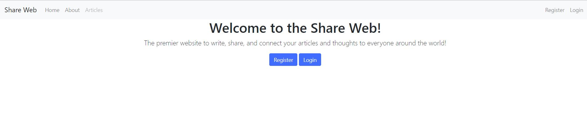
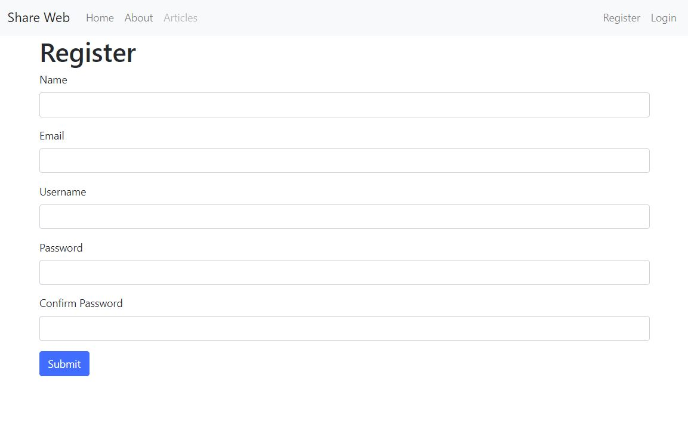
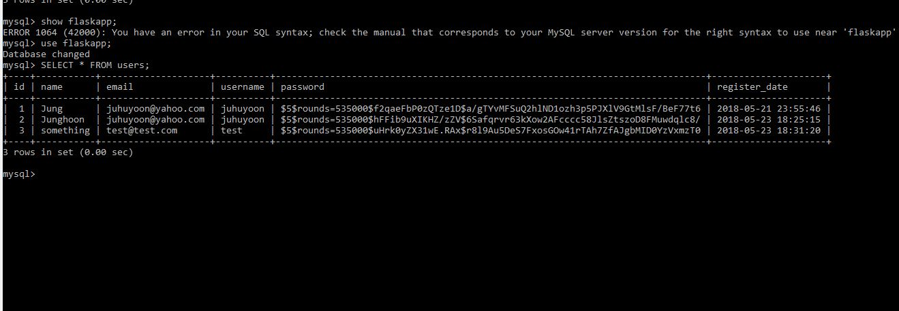
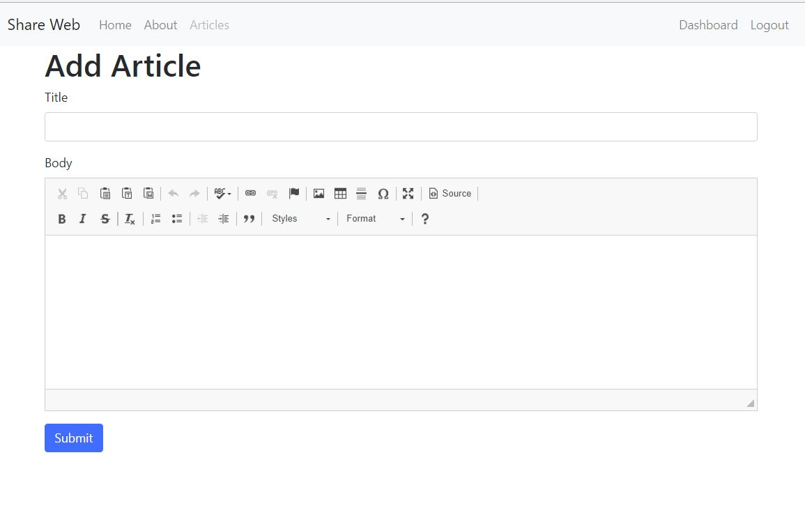

# Python_Flask_App

Fully Functional Data Storage App via CRUD functionality to store articles, hold authentication/login information, and can update your article pages.   

### Primarily built with Flask's micro-framework   

Used Python 3.6, Software needed to run:  
[Flask](http://flask.pocoo.org/docs/0.12/),  
[Flask-WTF](https://wtforms.readthedocs.io/en/stable/),   
[Passlib](https://passlib.readthedocs.io/en/stable/),  
[MYSQL](https://dev.mysql.com/doc/),  
[sha256 password](https://docs.python.org/2/library/hashlib.html)  
[ckeditor](https://ckeditor.com/)
### Running the app
on your command line run:  
```
python app.py
```

### What the App looks like:
1)  What the home page looks like  
2) Register on where the information will be stored in database  
3)Password is encrypted with sha256 password so it cannot be shown     
4) You will be taken to your dashboard after your registration/login  
5) Add your articles on with edits available via CKeditor  


